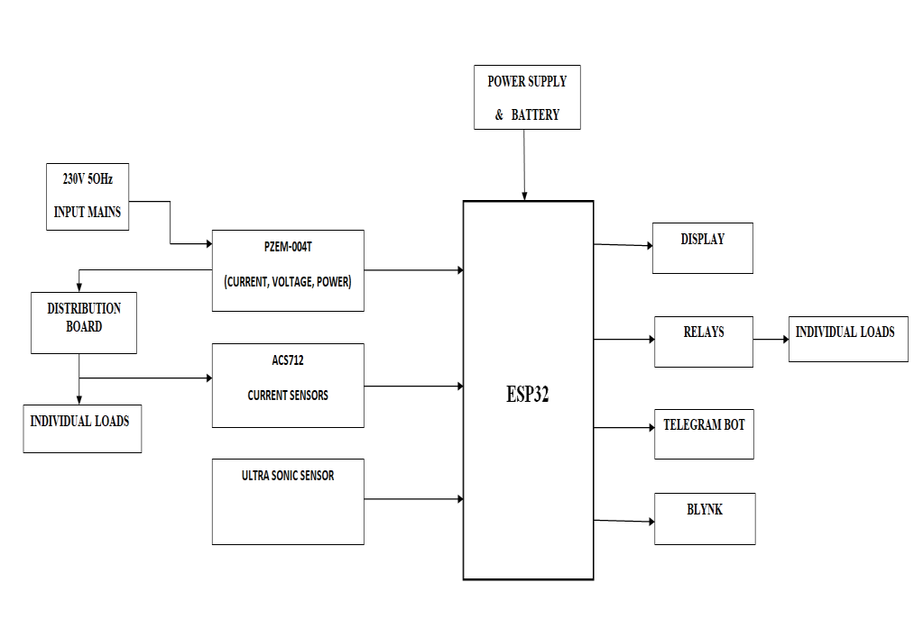
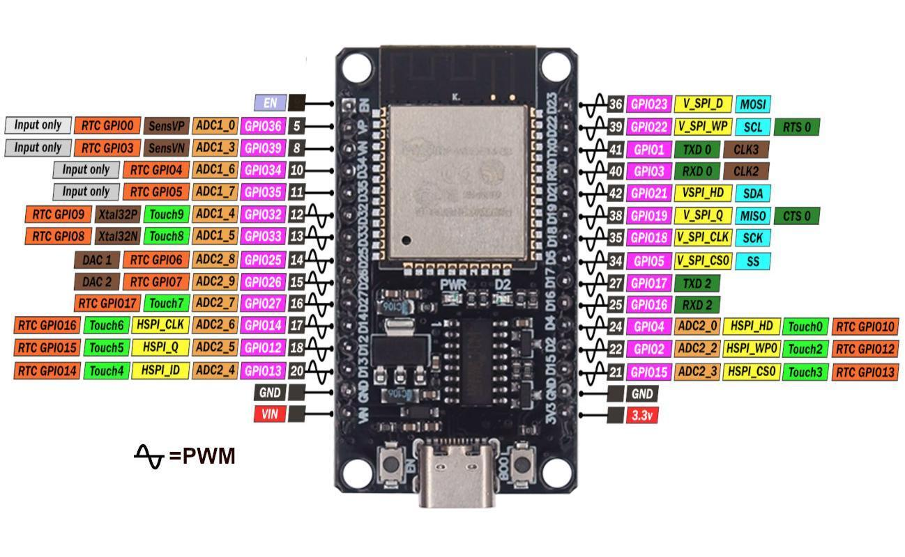
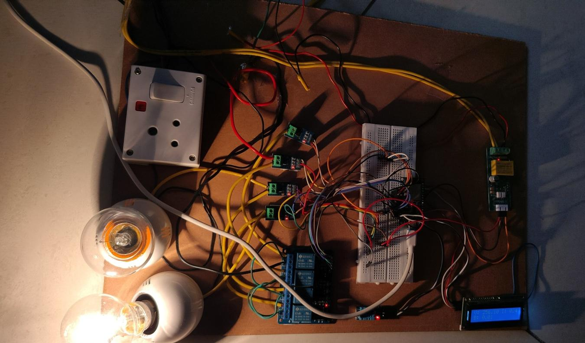
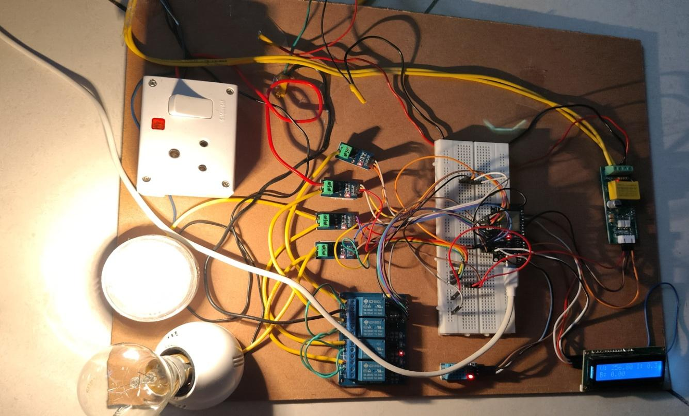
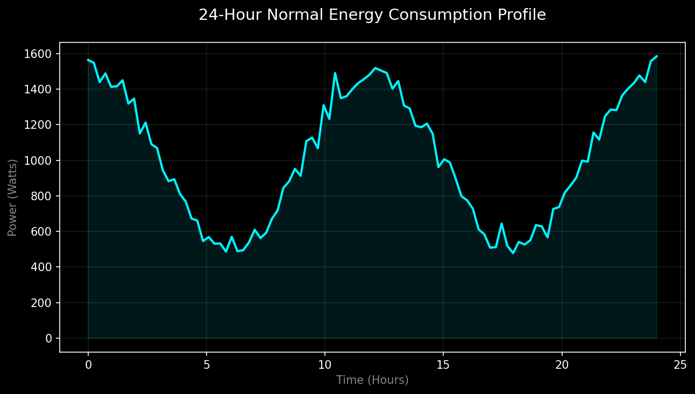
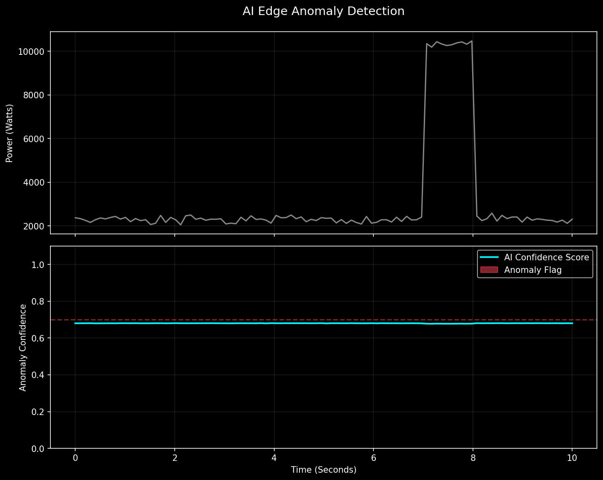
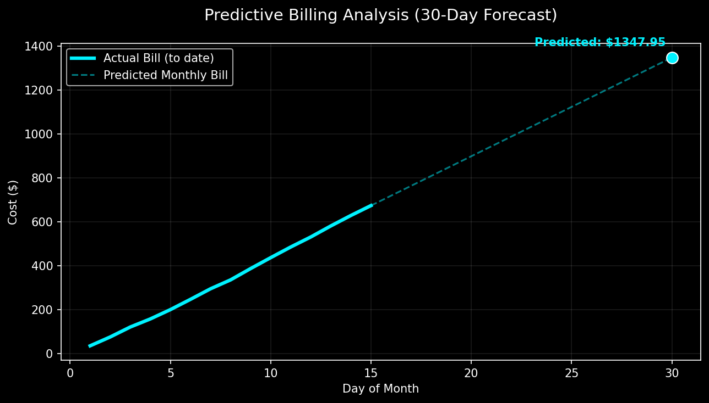

# 🔌 Smart Energy Meter with Predictive Bill Analysis

A professional-grade IoT solution for energy monitoring, featuring **Edge AI anomaly detection** and **predictive cost analysis**. This project demonstrates a complete hardware-to-software pipeline, including ESP32 firmware and a Python-based Digital Twin.

## 🌟 Key Features
- **Real-Time Monitoring**: Tracks Voltage, Current, Power, and cumulative Energy consumption.
- **Predictive Billing**: Advanced algorithm estimates the monthly electricity bill based on current usage trends.
- **Edge AI Anomaly Detection**: Lightweight Neural Network running on-chip to detect hazardous electrical patterns (e.g., overcurrent, surges).
- **Premium Web Dashboard**: A glassmorphic, dark-mode web interface hosted directly on the ESP32.
- **IoT Integration**: Seamless synchronization with **Blynk** (mobile app) and **ThingSpeak** (data logging).

---

## 🛠️ Project Structure
- `/Smart Energy Meter`: C++ ESP32 firmware (Arduino IDE compatible).
- `/Simulation`: Python Digital Twin suite for testing logic without physical hardware.

---

## 📊 Hardware & System Architecture
This project integrates high-precision sensors with the ESP32 microcontroller for comprehensive energy tracking.

### 1. System Block Diagram
The high-level architecture includes the ESP32 core, various sensors (PZEM, ACS712, Ultrasonic), and communication interfaces (Blynk, Telegram).

### 2. Hardware Pinout (ESP32)
The following diagram shows the pin configuration used for interfacing the PZEM-004T, ACS712 sensors, and the 16x2 LCD.

### 2. Physical Implementation
The project was prototyped using a custom electrical board with real-world loads (incandescent bulbs) for testing anomaly detection and billing accuracy.

## 📈 Digital Twin & Data Visualization
Since the hardware is modular, the project includes a simulation suite to verify the AI and Billing algorithms.

### 1. 24-Hour Energy Profile
Visualizes typical household consumption patterns, allowing for baseline testing of the billing engine.

### 2. Edge AI Anomaly Detection
Demonstrates the Neural Network flagging a high-current anomaly (simulated at 45A) with an anomaly confidence score.

### 3. Predictive Billing Forecast
Shows the transition from "Actual Bill" to "Predicted Monthly Bill" using the estimation logic.

---

## 🚀 Getting Started

### ESP32 Firmware
1. Open `Smart Energy Meter/Smart Energy Meter.ino` in Arduino IDE.
2. Install required libraries: `PZEM004Tv30`, `Blynk`, `LiquidCrystal_I2C`, `DHT`.
3. Update WiFi credentials in the code and flash to your device.

### Python Simulation
1. Navigate to `/Simulation`.
2. Install dependencies: `pip install matplotlib numpy`.
3. Run `python generate_assets.py` to regenerate the Digital Twin reports.

---

## 📜 Project Documentation
The complete technical project report, including circuit diagrams, literature survey, and testing cases, is available in the root directory as `b-10 project document.pdf`.

---
**Developed by:** D. NAGA JASWANTH & Team  
**ECE Department**, KITS
